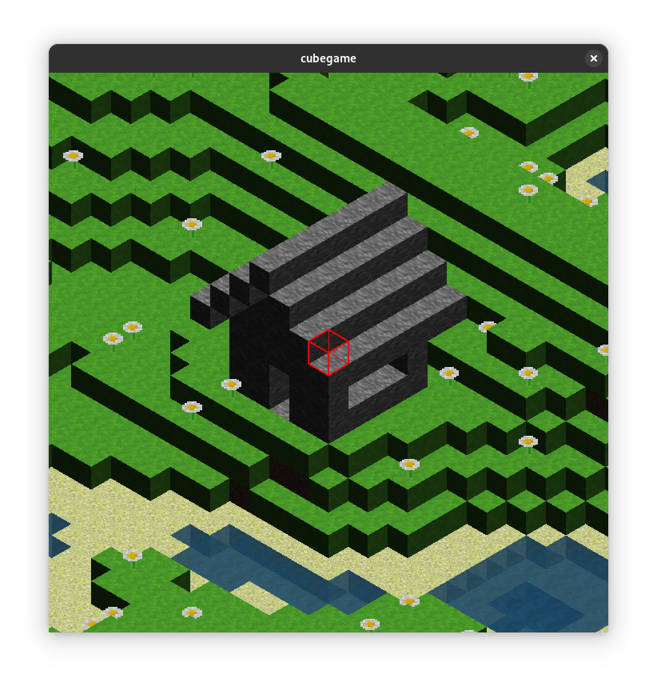

# cubegame
Isometric 3D game about placing/destroying blocks written in C using freeglut library.

In this game you can move with WASD keys and change block using P key.



# Build instructions

You need to install Git, freeglut and SOIL development files and GNU GCC compiler:

Fedora:
````
sudo dnf install git freeglut-devel SOIL-devel gcc
````

Then clone repository and compile source code:

````
git clone https://github.com/MichuuMichuu18/cubegame.git
gcc cubegame.c -o cubegame -lGL -lGLU -lSOIL -lglut -lm
````
